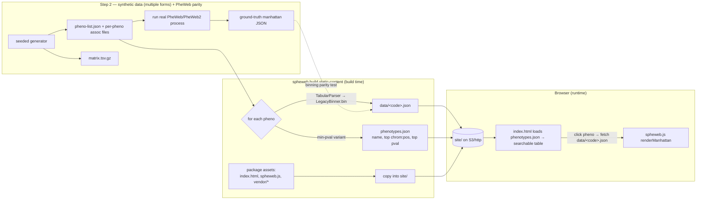

# SpheWeb v1: Manhattan-only Static Bundle

## Context

`spheweb` generates static, server-free GWAS sites so academic results outlive the
grant/server that produced them. PheWeb/PheWeb2 need a running Flask server; spheweb's
contribution is **orchestration/packaging** of already-static pieces, not new visualization.

The current code (now on the fetched `manhattan` branch) renders **one** Manhattan plot per
invocation as a single self-contained HTML file with the GWAS JSON Jinja-embedded inline
(`manhattan.html:43` → `var data = {{ data | tojson }}`). At ~134–164K per phenotype × 1000
phenotypes this hits a size wall. v1 fixes that by emitting **shared assets once + small
per-phenotype data fetched on demand** (pheweb issue #132's "shared JavaScript" approach):
a single `index.html` + `spheweb.js` renderer + vendored d3 + one small `data/<code>.json`
per phenotype.

**Decisions confirmed this session:**
1. **Tooling:** migrate to **uv** (packaging/dependency management) and **poe** (task runner),
   replacing `nox`. **Commit after every step.**
2. **Ingestion = `pheno-list.json`** (PheWeb-style: name → raw GWAS file). Raw GWAS files
   carry no gene/rsid annotations (`Variant` in `variant.py` has only
   `chrom/pos/ref/alt/pval/maf/alt_allele_freq/effect_size`). **v1 client-side search is
   phenotype-name + top-hit position only; gene-name search is deferred** to annotated ingestion.
3. **Data first:** the first feature task is a synthetic-data generator that emits the input in
   **multiple forms**, verified consumable by a real **PheWeb / PheWeb2 process** step —
   establishing a compatibility baseline and ground-truth fixtures *before* building the site.
4. **Branch hygiene:** `main` becomes the trunk (`manhattan` is 37 ahead but `main` has 3
   commits not in `manhattan` → merge, not fast-forward; `dev` is strictly behind).

**Key tradeoff:** the fetch-based bundle no longer opens via double-click `file://` (browsers
block `fetch()` of local files). It must be served over HTTP (`python -m http.server`, S3,
GitHub Pages) — inherent to killing the size wall, and the intended deployment model.

## Architecture / data flow

## Branch setup (do first)

At implementation time (requires remote write):
- `git checkout main && git merge manhattan` (merge commit — diverged histories).
- Delete `manhattan` and `dev` (local + remote).
- `git checkout -b feat/static-bundle-v1` off the new `main`. All v1 work lands here; PR targets `main`.
- Commit this plan into the repo as `plans/v1-static-bundle.md` so it travels with the code.

## Commit discipline

Each numbered work item below is a **self-contained commit** (repo uses conventional prefixes:
`feat:`/`chore:`/`refact:`). Before each commit, gates must be green:
`uv run poe check` (lint + typecheck + fast tests) and pre-commit (mypy strict, ruff).

## Work items (ordered, one commit each)

### 1. Migrate tooling to uv + poe — `pyproject.toml`, `.github/workflows/`, remove `noxfile.py`
- **Build/packaging via uv:** switch `[build-system]` to the uv-native backend
  (`requires = ["uv_build>=0.8"]`, `build-backend = "uv_build"`); version is already static
  (`0.0.1`) and `__version__` resolves via `importlib.metadata`, so no version-source plumbing.
  Generate `uv.lock` (`uv lock`). Dev workflow becomes `uv sync` / `uv run …` / `uv build`.
  Ensure the wheel still ships template assets (`templates/*.html`, later `*.js`, `vendor/*`) —
  configure `[tool.uv.build-backend]` data inclusion if uv_build doesn't pick them up by
  default; if template-data inclusion proves awkward, fall back to the `hatchling` backend.
- **Dev deps:** move the current `[project.optional-dependencies].test` (pytest, pytest-cov,
  html5lib) into a uv `[dependency-groups].dev` group and add `poethepoet`, `mypy`, `ruff`.
- **poe tasks:** add `[tool.poe.tasks]` — `test = "pytest"`,
  `test-slow = "pytest --run-slow --cov src --cov-fail-under=80"`, `lint = "ruff check ."`,
  `format = "ruff format ."`, `typecheck = "mypy src"`, and a `check` sequence (lint+typecheck+test).
- **Delete `noxfile.py`.** Rewrite `.github/workflows/build_and_test.yml` to use `astral-sh/setup-uv`,
  `uv sync`, and `uv run poe test-slow`; drop the retired `dev` branch from triggers; keep the
  OS×Python matrix (use uv's `--python` for versions).
- Minor cleanup: fix `classifiers` (still lists 3.7/3.8 though `requires-python = ">=3.9"`).
- _Commit:_ `chore: Migrate to uv + poe, retire nox`.

### 2. Synthetic input data in multiple forms + PheWeb/PheWeb2 parity — `src/spheweb/utils.py`
A deterministic generator producing v1 input in every form spheweb must accept, proven
compatible with a real PheWeb pipeline.
- Extend/consolidate the existing generators (`create_phenotype_GWAS_file`,
  `create_matrix_gz_file`) to emit, from one **seeded** call:
  - **Form A (v1 primary):** a PheWeb-style raw input set = a `pheno-list.json` + one assoc
    file per phenotype (exactly the format Work item 4 consumes — shared format de-risks ingestion).
  - **Form B:** the processed multi-phenotype `matrix.tsv.gz` (already supported; for the
    deferred annotated/Phase-2 path).
  - Parameterize delimiter and exercise `Variant`'s column aliases (`#chrom`/`chr`, `p_value`/`pval`).
  - Replace fixed values (pval=0.01, …) with a **seeded** spread of pvals/positions so binning
    output is meaningful and reproducible.
- **Parity / ground truth:** add a slow-marked, skip-if-unavailable test that runs Form A through
  a real **PheWeb** process step (`pheweb` installed via the agent proxy) — and **PheWeb2** if it
  installs cleanly — to (a) confirm upstream accepts the synthetic input and (b) capture PheWeb's
  manhattan JSON as a checked-in fixture, extending the byte-for-byte pattern already in
  `test_legacy_binning.py` (which diffs against `test/pheno_manhattan.json`) into a regenerable,
  multi-phenotype ground truth.
- Surface via CLI: extend `synthetic-gwas` (or add `synthetic-dataset`) to emit a full Form-A
  directory with `--seed`, `--num-phenos`, `--num-variants` for tests and the tutorial.
- _Commit:_ `feat: Synthetic dataset generator (multi-form) + PheWeb parity fixtures`.

### 3. De-hardcode the assembly — `src/spheweb/process.py`
Hardcoded at `generate_legacy_manhattan_json` (`process.py:27`, `..."canfam4"`) and
`render_manhattan_plot_SVG_from_legacy_JSON_data` (`process.py:78`, `..."canFam4"  # NOTE HARD CODED!`).
- Add an `assembly: str` param to both; pass to `chromosomes.get_premade_assembly_chroms(assembly)`
  (supports `hg19/grch37`, `hg38/grch38`, `canfam4` — `chromosomes.py:199`).
- Thread `--ref` through callers (`cli.py`, `test_legacy_binning.py`, `test_render.py`, `test_pdf.py`).
- _Commit:_ `refact: Thread assembly through, remove canFam4 hardcoding`.

### 4. Multi-phenotype ingestion + site generator — `src/spheweb/process.py`
- Refactor the single-file core out of `generate_legacy_manhattan_json` into
  `bin_gwas_file(data_file, chroms, delim) -> dict` (returns `{variant_bins, unbinned_variants}`);
  `generate_legacy_manhattan_json` becomes a thin JSON-writing wrapper.
- New `build_static_site(pheno_list_path, assembly, out_dir, delim=",") -> None`:
  - Parse the **same `pheno-list.json`** Step 2 emits (array of
    `{"phenocode", "phenostring"?, "assoc_files": [path]}`; one assoc file per pheno in v1).
  - For each pheno: `bin_gwas_file(...)` → write `out_dir/data/<phenocode>.json`.
  - Build `phenotypes.json`: `{phenocode, phenostring, top_chrom, top_pos, top_pval}` (top hit =
    min-`pval` variant seen during binning; **no nearest-gene column** — absent in raw GWAS).
  - Copy package assets (`index.html`, `spheweb.js`, `vendor/*`) into `out_dir`.
- _Commit:_ `feat: Multi-phenotype static-site builder from pheno-list.json`.

### 5. Split the template into a shared-asset renderer — `src/spheweb/templates/`
- **New `spheweb.js`:** lift the `<script>` body from `manhattan.html` (`create_manhattan_plot(...)`
  at `manhattan.html:55`, `tooltip_underscoretemplate`, chrom-offset/scale/axis logic). Expose
  `window.spheweb.renderManhattan(containerId, data)`. JS derives chrom offsets from the data, so
  no client-side assembly table needed.
- **New `index.html`:** phenotype-list UI + client-side filter over **phenocode/phenostring +
  top-hit chrom:pos** (NOT genes); on click `fetch('data/'+code+'.json')` →
  `spheweb.renderManhattan(...)`.
- **Vendor JS** under `templates/vendor/`: d3 v5.16, d3-tip 0.9.1, underscore 1.8.3 (currently CDN
  at `manhattan.html:31-35`). **Verify jquery is actually used** before vendoring it — drop if not.
- **Repurpose `manhattan.html`** into a thin single-file export that inlines data and loads the
  same `spheweb.js` (one renderer, no duplicated d3) so the low-level `build` path still works.
- Confirm the wheel ships `templates/*.js` + `templates/vendor/*` (uv_build data config from Step 1).
- _Commit:_ `refact: Shared spheweb.js renderer + fetch-based index.html`.

### 6. CLI — restructure `build` into a group — `src/spheweb/cli.py`
- Turn `build` (`cli.py:18-29`) into a Click group:
  - `spheweb build static-content --phenos pheno-list.json --ref <assembly> --out site/`
    → `process.build_static_site(...)`.
  - `spheweb build pdf <matrix.tsv.gz> --out ...` → existing `process.render_pdf` (fold in hidden
    `matrix_to_pdf`; keep experimental).
  - Keep old json→single-html as `build single` (hidden), wired to the repurposed `manhattan.html`.
- _Commit:_ `feat: build static-content CLI command`.

### 7. Consolidation / debt
- **matplotlib SVG path** (`render_manhattan_plot_SVG_from_legacy_JSON_data`): keep for PDF only;
  docstring experimental; `svg_manhattan` stays hidden. Do not extend.
- **`render_pdf` placeholders** (hardcoded 2-variant dict `process.py:305-338`; `"rsid???"`/`"Gene???"`
  cells `process.py:288-291`): mark `render_pdf` EXPERIMENTAL in its docstring (PDF stays secondary).
- **sqlite experiments** (`utils.convert_tsv_gz_to_sqlite`, `convert_tsv_gz_to_normalized_sqlite`):
  not smaller than gzip — **delete** them, remove hidden `matrix_to_sqlite` CLI (`cli.py:104-108`),
  delete `test/test_utils.py`.
- **`binning.py` ABC + `WindowBinner` stub** (`bin()` → `{"TODO": "implement"}`): confirm
  `LegacyBinner` doesn't subclass `binning.Binner`; if independent, **delete `binning.py`** and any
  `WindowBinner` test. Keep `LegacyBinner` as the one binner.
- _Commit:_ `chore: Quarantine PDF/SVG experiments, drop sqlite + binner ABC`.

### 8. Tutorial / README + static-site tests
- New `test/test_static_site.py`: synthetic phenos → `build_static_site(...)` → assert `index.html`,
  `phenotypes.json`, one `data/<code>.json` per pheno exist; assert **no per-phenotype HTML** (only
  one `index.html`); html5lib-validate `index.html`; assert each `data/<code>.json` raw size `< 150K`
  (guards the size-wall fix). Extend `test_render.py`/`test_cli.py` for the assembly param + `build static-content`.
- Replace README "Getting Started: TODO" with a deterministic walkthrough on Step 2's seeded
  generator: emit a Form-A dataset, run `spheweb build static-content` (show `uvx spheweb …`), then
  `python -m http.server` over `site/` and click a phenotype. State the HTTP-serving requirement (no `file://`).
- _Commit:_ `feat: static-site tests + end-to-end tutorial`.

## Verification

- **Gates per commit:** `uv run poe check` (ruff + mypy strict + fast tests) and pre-commit pass.
- **Full suite:** `uv run poe test-slow` (includes the PheWeb-parity + slow render tests, with
  `--cov-fail-under=80`); CI runs the same across the OS×Python matrix via uv + poe.
- **Manual:** `python -m http.server` over `site/`, click a phenotype, confirm the Manhattan plot
  renders from fetched JSON. Optionally push to a test S3 bucket (gzip; future Phase-2 CORS/Range home).

## Deferred (post-v1)
- Phase 2: bgzip+tabix matrix, LocusZoom region view + PheWAS variant view via S3 Range reads
  (document CORS + Range headers) — where the collaborator's range-request idea lands.
- Gene-name & rsid/variant autocomplete (needs annotated ingestion absent from raw GWAS).
- PDF beyond the experimental snapshot.
